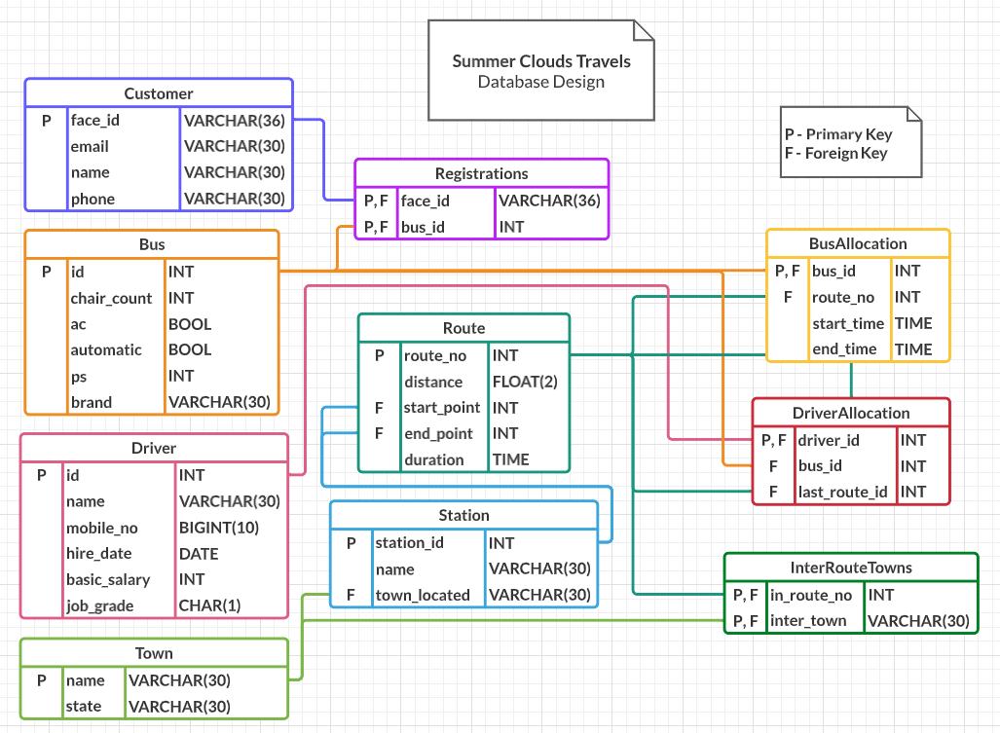
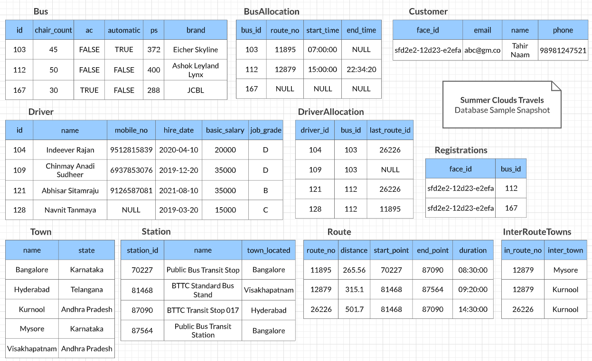
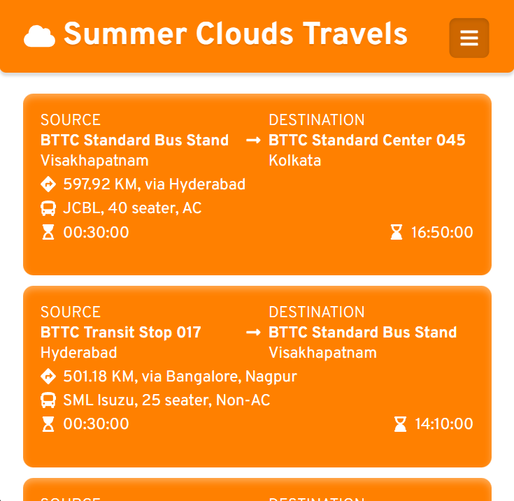
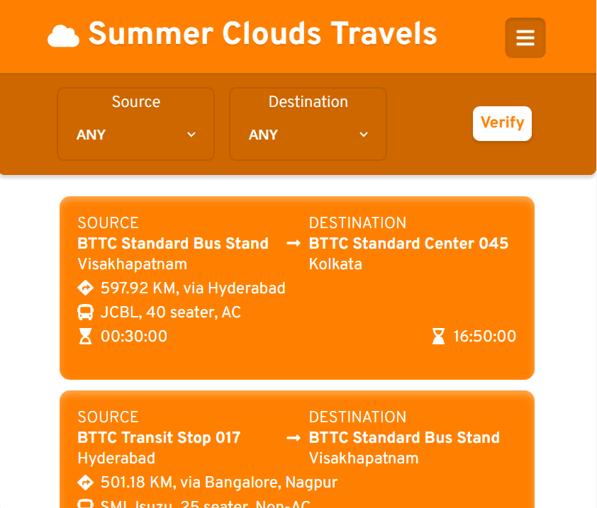
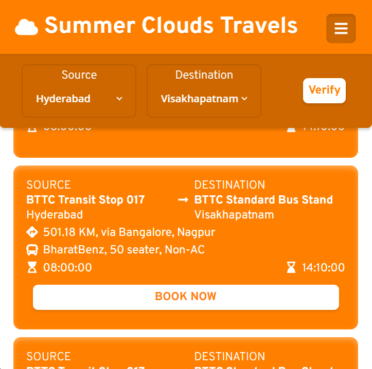
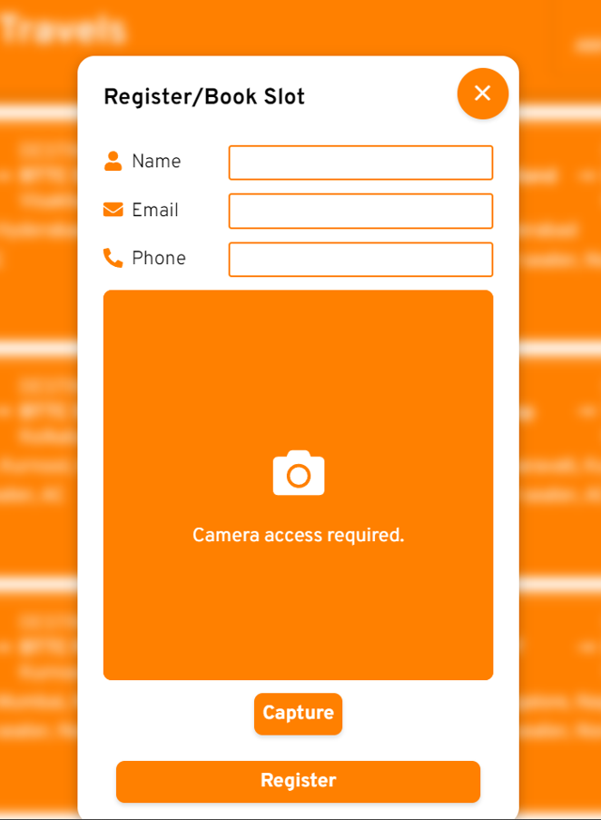
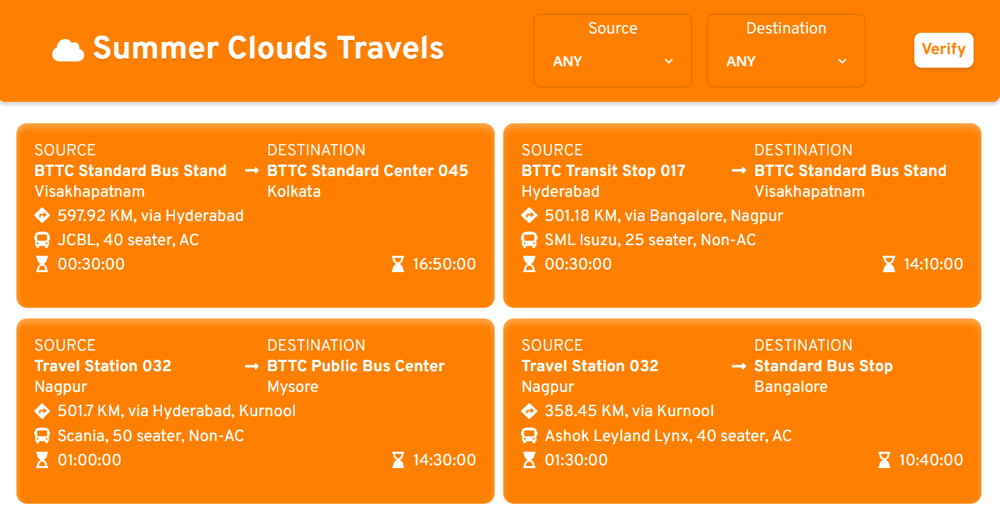
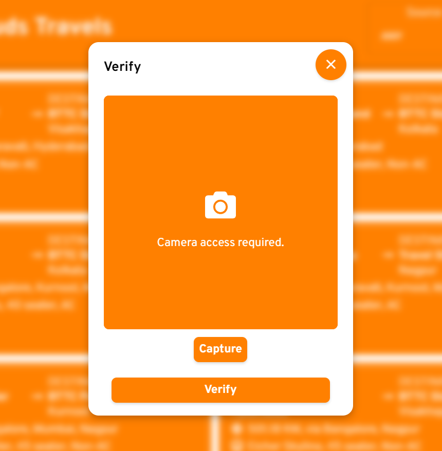
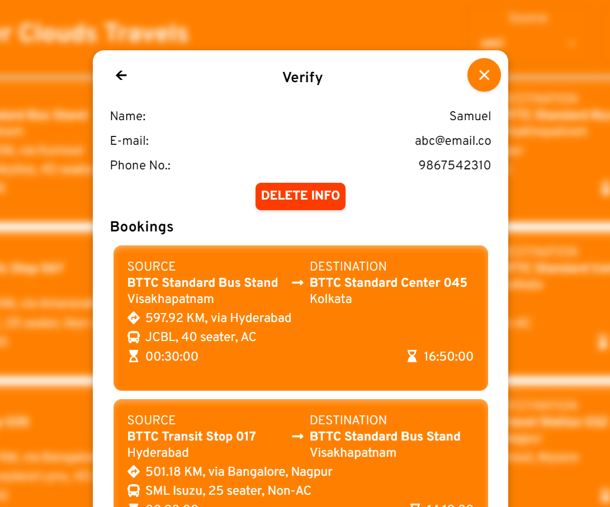

# Travels App
## Summer Clouds Travels Service

### Web Application
**Summer Clouds Travels Service** is a web application developed using _ReactJS, NodeJS, Express &amp; MySQL_.
This application is developed to make use various popular web frameworks, libraries, cloud services, etc. The application is developed for educational purpose, so for simplicity, not much emphasis is put on business logic to meet real standards and strict constraints. The application saves users data based on the user's facial identity. The registrations/bookings of the user can visited by verifying their facial identity.

### Cloud
Various cloud services provided by AWS in free tier are used. The application is deployed on an *AWS EC2* Ubuntu virtual machine instance. The static website and NodeJS server are deployed and served by an *NGINX* web server. The application uses *AWS Rekognition* service for facial recognition and verification features. The database used is provided by *AWS RDS*.

### Database
A *MySQL* database is used for this web application. The database is deployed on *AWS Relational Database Service (RDS)*.
#### Database description
- A country bus company owns a number of buses. A bus is characterized by the number, no. of chairs, options (AC, Automatic, PS), and brand name. 
- Each bus is allocated to a particular route, although some routes may have several buses. Each route is described by KM, start point, endpoint and duration. 
- Each route can pass through a number of towns. 
- A town may be situated along several routes. We keep track of unique names and station names in each town. 
- One or more drivers are allocated to one route during a period of time. The system keeps the information about the driver name, mobile number, hire date, basic salary, job grade.
- The system keeps the information about any changes in the allocations of the drivers to the routes and the last route assigned to each driver.
- A customer can book a slot in multiple buses. Customer is identified by their facial identity.

#### Database Design

#### Database Sample Snapshot

### Website Screenshots

